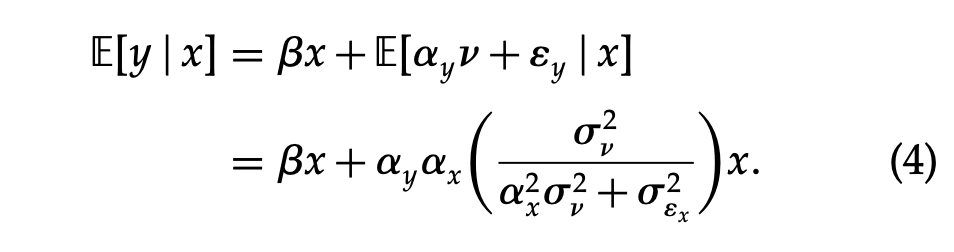

In this post, I derive the expression in equation (4) of [@rossi2014iv], as shown in the screenshot below. 

### Setup
The author provides the following system of regression equations:

\begin{align}
y = & \beta x + \alpha_y v + \epsilon_y (\#eq:yxv) \\
x = & \alpha_x v + \epsilon_x (\#eq:xv) \\
E(\epsilon_y|x, v) = & 0 \,\, \& \,\, E(\epsilon_x|x, v) = 0 \,\, \& \,\, \epsilon_y \perp\!\!\!\perp \epsilon_x (\#eq:errors)
\end{align}

In the above equations:
1.  $y, x, v, \epsilon_y, \epsilon_x$ are $n \, \times \, 1$ vectors, where $n$ is the number of data points. They are all assumed to be mean zero. 
2.  $\epsilon_{x,i} \sim N(0, \sigma_{\epsilon_x}^2)$,  $v_i \sim N(0, \sigma_v^2)$ 
3. $E$ is the [expectation operator](https://en.wikipedia.org/wiki/Expected_value).
4. From standard results (in the equations below, $x'$ is the [transpose](https://en.wikipedia.org/wiki/Transpose) of a vector $x$; $Var(v_i)$ denotes the variance of the random variable $v_i$):

    - $Var(v_i) = E(v_i^2) - E(v_i)^2 = E(v_i^2)$, since $E(v_i) = 0$ from [1.](#mean)
    -  $Var(v) = \sigma_v^2$ from [2.](#variance) Hence $E(v_i^2) = \sigma_v^2$.  Also, $E(v'v) = E(\sum\limits_{i=1}^{n} v_i^2) = \sum\limits_{i=1}^{n} E(v_i^2) = n\sigma_v^2$
    - $Var(\epsilon_{x,i}) = E(\epsilon_x'\epsilon_x) - E(\epsilon_x)'E(\epsilon_x) = E(\epsilon_x'\epsilon_x)$, since $E(\epsilon_x) = 0$ from [1.](#mean)
    -  $Var(\epsilon_{x,i}) = \sigma_{\epsilon_x}^2$ from [2.](#variance) Hence $E(\epsilon_{x,i}^2) = \sigma_{\epsilon_x}^2$.  Also, $E(\epsilon_x'\epsilon_x) = E(\sum\limits_{i=1}^{n} \epsilon_{x,i}^2) = \sum\limits_{i=1}^{n} E(\epsilon_{x,i}^2) = n\sigma_{\epsilon_x}^2$

5. The conditions from equation \@ref(eq:errors) give us the following identities:

    -  $E(x'\epsilon_y) = E(\epsilon_y' x) = 0$ 
    -  $E(v'\epsilon_x) = E(\epsilon_x' v) = 0$ 
    -  $E(x'v) = E(v'x) = E((\alpha_x v + \epsilon_x)'v) = \alpha_xE(v'v) + E(\epsilon_x'v) = n\alpha_x \sigma_v^2 + 0 = n\alpha_x \sigma_v^2$ (from [4b](#vvar) and [5b](#vecorr))

### Omitting $v$
If we regress $y$ on $x$ only (**omitting** $v$), we have something like this:

\begin{align}
y = \beta x + \epsilon_c
\end{align}

Where $\epsilon_c$ is the "composite error term" and from \@ref(eq:yxv), we have $\epsilon_c = \alpha_y v + \epsilon_y$. The expected value of $y$ given $x$ ($E(y|x)$), is now:

\begin{align}
E(y|x) = & E(\beta x | x) + E(\epsilon_c|x) \\
\implies E(y|x) = & \beta x + E(\alpha_y v + \epsilon_y|x)
\end{align}

Where I use the fact that $E(\beta x | x) = \beta E(x|x) = \beta x$ (since the expectation operator is a linear operator and $E(x|x) = x$). I find the value of the second term $E(\alpha_y v + \epsilon_y|x)$.

### Conditional Expectation of the Composite Error Term
Let's call $z = \alpha_y v + \epsilon_y$. By construction, $z$ is an $n \times 1$ vector. I now regress $z$ on $x$, i.e.
\begin{align}
z = & \gamma x + \epsilon_z \\
\implies \epsilon_z = & z - \gamma x
\end{align}

I want to choose $\gamma$ in such a way that $E(\epsilon_z'\epsilon_z)$ is minimized (ideally we want $E(\epsilon_z'\epsilon_z) = 0$ or as close to $0$ as possible). Said another way, we want to choose our coefficient $\gamma$ that the expected value of the sum of squared error terms $\epsilon_{z,i}$ as close to zero as possible (which it the smallest value the sum of squared real numbers can take). When this is true, I have $E(z|x)= E(\alpha_y v + \epsilon_y|x) = \gamma x$. Since $\epsilon_z = z - \gamma x$, I have 

\begin{align}
E(\epsilon_z'\epsilon_z) = & E((z - \gamma x)'(z - \gamma x)) \\
\implies E(\epsilon_z'\epsilon_z) = & E(z'z - \gamma (x'z + z'x) + \gamma^2 x'x) \\
= & E(z'z) - \gamma E(x'z + z'x) + \gamma^2 E(x'x) \\
= & E(z'z) - 2 \gamma E(x'z) + \gamma^2 E(x'x) (\#eq:objfun)
\end{align}

Where \@ref(eq:objfun) follows from the fact that $x'z$ is scalar (both are $n \times 1$ vectors), so $x'z = z'x$; applying the expectation operator on both sides, I have $E(x'z) = E(z'x)$. I now take the partial derivative of \@ref(eq:objfun) with respect to $\gamma$.

\begin{align}
\frac{\partial E(\epsilon_z'\epsilon_z)}{\partial \gamma} = & \frac{\partial (E(z'z)}{\partial \gamma} - \frac{\partial (2 \gamma E(x'z))}{\partial \gamma} + \frac{\partial (\gamma^2 E(x'x))}{\partial \gamma} = 0 \\
  \implies & 0 - 2E(x'z) + 2 \gamma E(x'x) = 0 \\
  \implies & \gamma = \frac{E(x'z)}{E(x'x)} (\#eq:gammaex)
\end{align}

I now want to find the values of $E(x'z)$ and $E(x'x)$, which is straightforward, as shown below:

\begin{align}
E(x'z) = & E(x'(\alpha_y v + \epsilon_y)) \\
= & \alpha_y E(x'v) + E(x'\epsilon_y) \\
\implies E(x'z) = & n\alpha_y \alpha_x \sigma_v^2 + 0 = n\alpha_y \alpha_x \sigma_v^2 (\#eq:num)
\end{align}
Where I used the following results:
1. $E(x'\epsilon_y) = 0$, from [5a](#xecorr)
2. $E(x'v) = n\alpha_x \sigma_v^2$, from [5c](#vxcorr)

\begin{align}
E(x'x) = & E((\alpha_x v + \epsilon_x)'(\alpha_x v + \epsilon_x)) \\
       = & E(\alpha_x^2 v'v + \alpha_x \epsilon_x'v + \alpha_x v'\epsilon_x + \epsilon_x'\epsilon_x) \\
       = & \alpha_x^2 E( v'v) + 2 \alpha_x E( \epsilon_x'v ) + E(\epsilon_x'\epsilon_x) \\
\implies E(x'x) = & n\alpha_x^2 \sigma_v^2 + n\sigma_{\epsilon_x}^2 (\#eq:den)
\end{align}
Where I used the following results:
1. $E(\epsilon_x'v) = 0$, from [5b](#vecorr)
2. $E(v'v) = n\sigma_v^2$, from [4b](#vvar)
3. $E(\epsilon_x'\epsilon_x) = n\sigma_{\epsilon_x}^2$, from [4d](#evar)

From \@ref(eq:gammaex), \@ref(eq:num) and \@ref(eq:den), I have:
\begin{align}
  \gamma = & \frac{E(x'z)}{E(x'x)} =  \frac{n\alpha_y \alpha_x \sigma_v^2}{n(\alpha_x^2 \sigma_v^2 + \sigma_{\epsilon_x}^2)}  = \frac{\alpha_y \alpha_x \sigma_v^2}{\alpha_x^2 \sigma_v^2 + \sigma_{\epsilon_x}^2} \\
  E(z|x) = & E(\alpha_y v + \epsilon_y | x) =  \gamma x = \frac{\alpha_y \alpha_x \sigma_v^2}{\alpha_x^2 \sigma_v^2 + \sigma_{\epsilon_x}^2} x
\end{align}

Which completes the proof.

### Conclusion
In this post, I derive the expression for the bias in the coefficient of $x$, when you regress $y$ on $x$ without including the other independent variable $v$. This is called the omitted variable bias, and depending on the nature of this bias, the regression could come back with spurious results, something I'll discuss in another post.

# References

