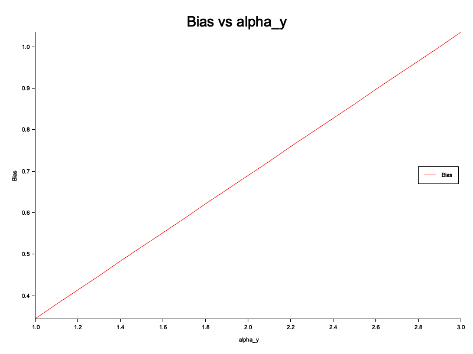
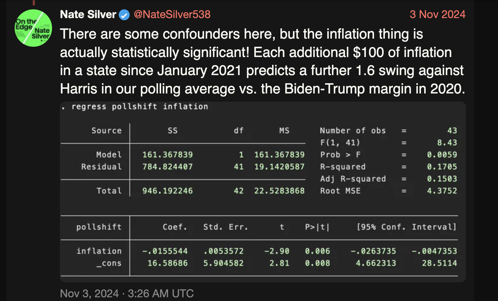

In this post, I provide a fictional and a real example of omitted variables bias, leading to spurious results. I leverage the [rust package](https://github.com/jModeler/marketing-iv-methods-examination) I created to provide values in the fictional example.

## 1. A Surprising Discovery

An eager analyst bursts into a meeting with their manager, excited to share a *mind-blowing* insight.

> "I've just run a regression of units sold on price," they say.
> "And guess what? The coefficient on price is **positive**."

The analyst explains what this means:

> “It implies that **demand increases as prices go up**. So we can just keep increasing prices and watch our units sold improve!”

The manager raises an eyebrow. The analyst continues, showing the regression results:

```bash
$ cargo run -- biased-regression  
Biased regression (y ~ x) coefficients:
[1.052973708551545], shape=[1], strides=[0], layout=CFcf (0xf), const ndim=1
```

## 2. A Second Opinion

The manager remains skeptical.

> “Do we have data on **marketing spend**? That might be an important factor you're missing.”

The analyst admits they do, and the manager suggests including it in the model.

> "Try including marketing as a variable. Then let’s see if price still has a positive effect.”

The analyst reruns the regression with the additional variable:

```bash
$ cargo run -- main-regression
Main regression (y ~ x + v) coefficients:
[-0.5054866125415705, 4.520452827902804], shape=[2], strides=[1], layout=CFcf (0xf), const ndim=1
```

Now, the picture becomes clearer:

* **Price actually has a negative effect on demand** ($\sim -0.5$), as expected.
* The previously positive coefficient was due to an **omitted variable**, marketing spend, that correlates with both price and units sold.

## 3. The Takeaway: Omitted Variable Bias Is Real

Omitted variable bias can lead analysts to **completely wrong conclusions**, especially when important drivers of behavior (like marketing) are left out.

To illustrate this, I ran simulations that vary a parameter called `alpha_y`, which controls how much marketing influences demand (i.e. the coefficient of the marketing spend in the main regression equation). As `alpha_y` increases, the **bias in the price coefficient** also increases—misleading you further if marketing is ignored.



## In Popular Media
Nate Silver, a popular statistican tweeted (X-ed?) [this](https://xcancel.com/NateSilver538/status/1852915210845073445#m) back in November 2024 (screenshot provided below):


He used a naive regression model to conclude that inflation caused the polls to shift against then presidential candidate Kamala Harris. His results suffer from not including confounding variables (he himself says so in his tweet). The reason he's seeing a negative coefficient could be due to the fact that he doesn't control for the political leanings of states (red or blue). Red states would've been biased against Harris, inflation or not. 

## Conclusion

Always think carefully about **which variables belong in your model**. Regression isn't just about throwing numbers into a formula—**causal reasoning matters**.

If you omit key drivers, like marketing in this case, your conclusions might not just be off—they might be dangerously wrong.


