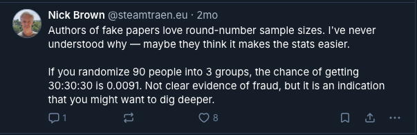

This post is inspired by a [Bluesky post](https://bsky.app/profile/steamtraen.eu/post/3m43veszxmc2j) by Nick Brown. A screenshot of the post is provided below:


I wanted to derive this result. We need to count the following:

1. The number of ways in which we can create 3 equal groups of 30, and
2. The total number of ways in which we can create 3 groups from 90 test subjects

### Three Equal Groups of 30
Starting with a subject size of 90, we can select 30 subjects from this pool in $\binom{90}{30}$ ways.
Take these 30 subjects out of the original pool, we now have 60 subjects left. We can select 30 from this remnant pool in $\binom{60}{30}$ ways. Taking these 30 subjects out of 60, we are left with 30 subjects, which is our third group.

The total number of ways to create 3 groups of equal size from a total subject pool of 90 is given by:

\begin{align}
\binom{90}{30} \times \binom{60}{30} = \frac{90!}{(30!)^3} (\#eq:eqsize)
\end{align}

### Create Three Groups
We now release the restriction that the groups should have equal size. Now each subject can be allocated to any group:

1. Subject 1 can be assigned to any of the three groups. This can be done in 3 ways.
2. Subject 2 can be assigned to any of the three groups. This can be done in 3 ways.
3. Subject 3 can be assigned to any of the three groups. This can be done in 3 ways.

... and so on. Multiplying all the ways of assigning each individual subject to one of the three groups gives us the total number of ways to create 3 groups of any size from a sample size of 90:

\begin{align}
\underbrace{3 \times 3 \times \dots 3}_{90\text{ times}} = 3^{90} (\#eq:anysize)
\end{align}

### Chances of Getting Three Groups of Equal Size <a name="proof"></a>
Putting \@ref(eq:eqsize) and \@ref(eq:anysize) together, the chances of getting 3 groups with equal sample size is given by:

\begin{align}
 \frac{90!}{(30!)^3} / 3^{90} = \frac{90!}{(30!)^3 \times 3^{90}} \approx 0.0091
\end{align}

This completes the proof.

### Empirical Verification
Here's some python code that computes the empirical probability of getting 3 groups of equal sizes from a total sample size of 90.

```{r setup, echo=FALSE}
# setup for using python code later in the page
library(reticulate)
use_python("/Users/swarnalatha/.pyenv/shims/python")
```


```{python, echo=TRUE, eval=TRUE}

from random import seed, random
from collections import Counter

seed(100)

n = 1_000_000

data = range(n)

subjects = 90

def assign():
    p = random()
    if p <= 1/3:
        return 1
    elif p <= 2/3:
        return 2
    else:
        return 3

def get_group_counts(subjects):
    groups = [assign() for _ in range(subjects)]
    tally = Counter(groups)
    return list(tally.values())

result = [get_group_counts(subjects) for _ in data]

def get_equal_groups(result, n):
    flag = [1 if ll == [30, 30, 30] else 0 for ll in result]
    count = Counter(flag)[1]
    return count/n

print(get_equal_groups(result, n))
```

Which is similar to the number we got in [the proof above](#proof). 