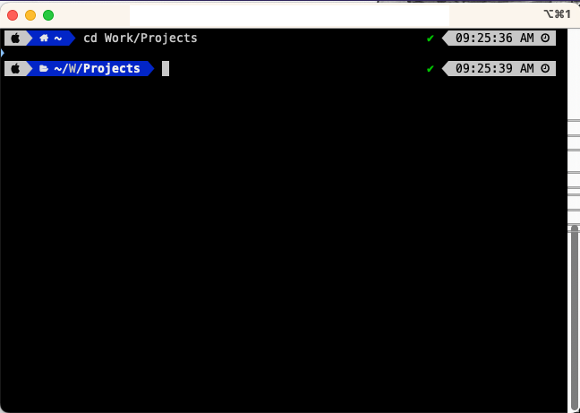
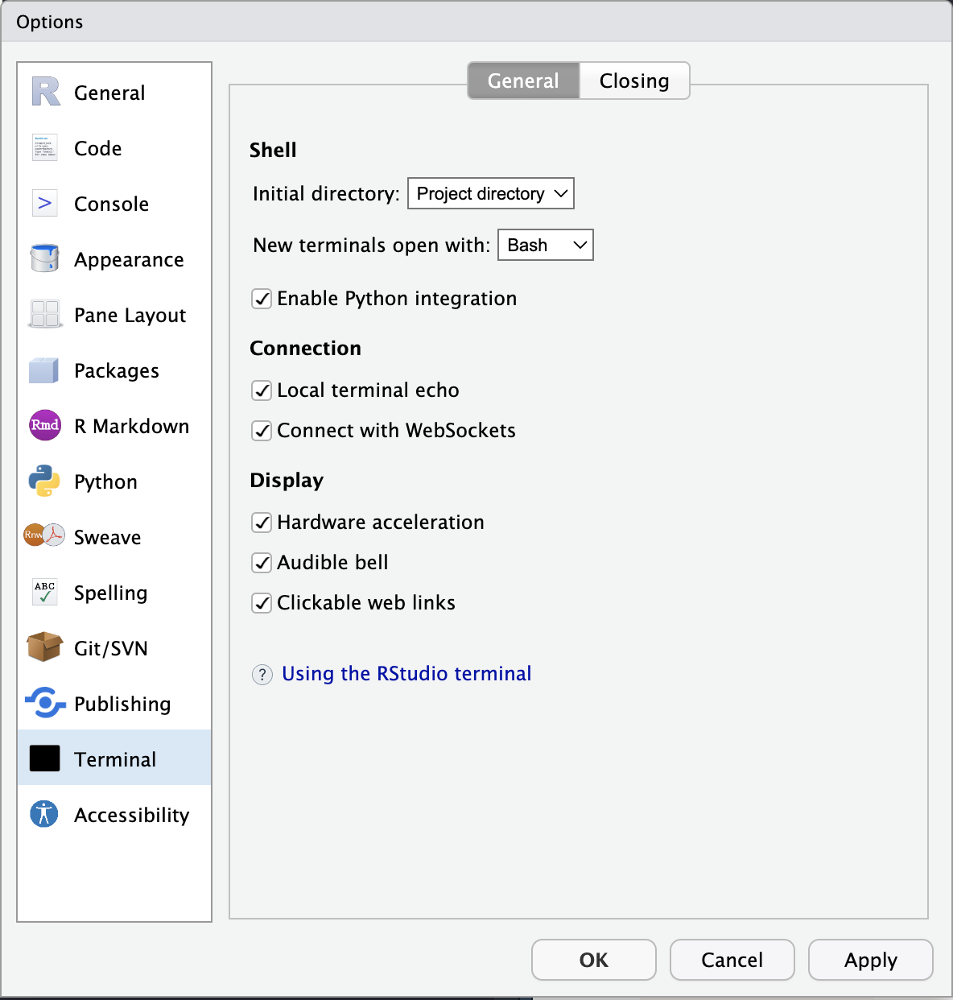
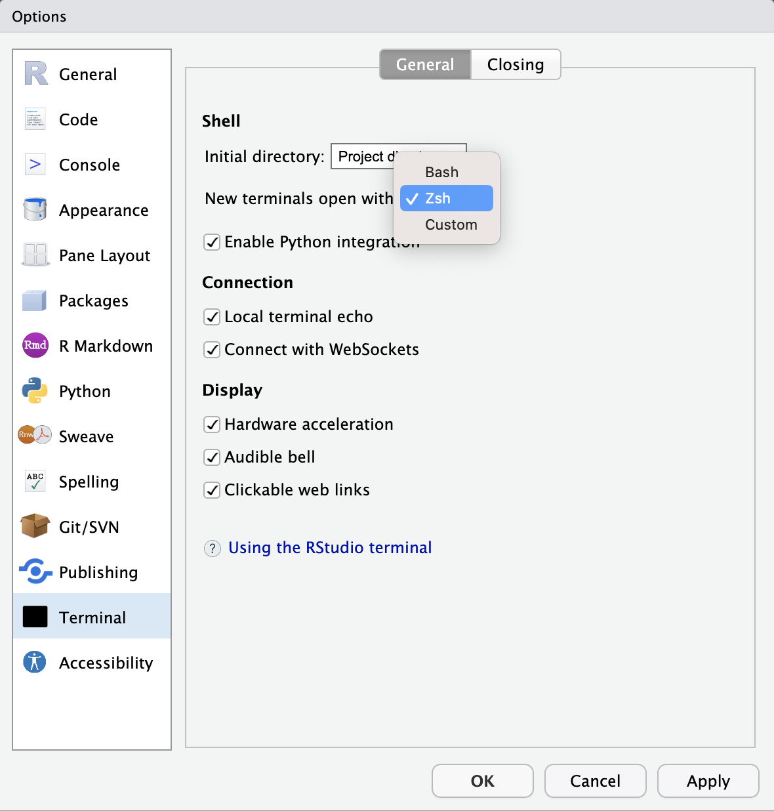
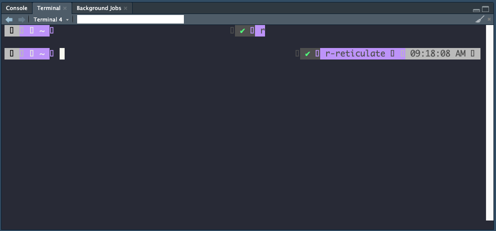
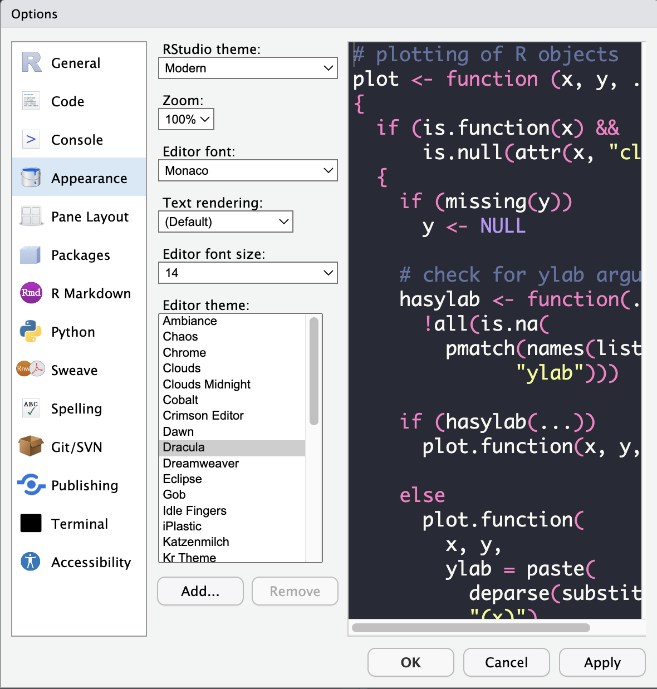
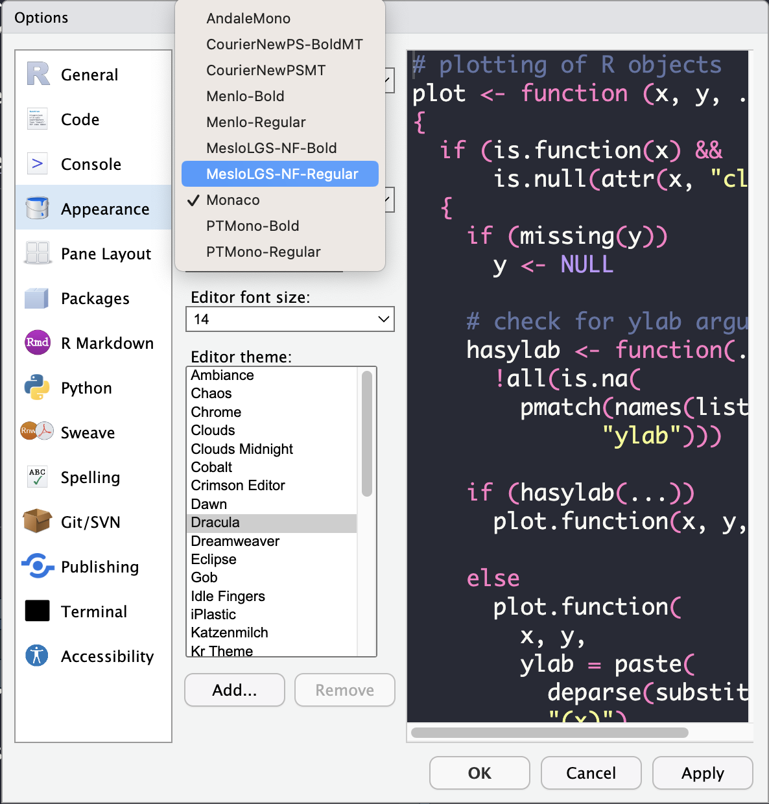
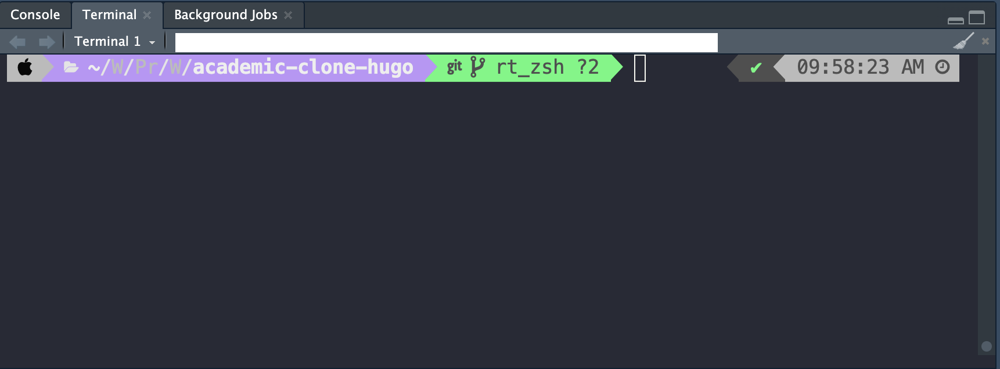

I've been using [ohmyzsh](https://ohmyz.sh/) with the [powerlevel10k](https://github.com/romkatv/powerlevel10k) theme to enhance my terminal experience, as I find myself spending more time on it while working on a few projects. A screenshot of this "enhanced" terminal is shown below:

I was wondering if I could get the terminal within [RStudio](https://posit.co/products/open-source/rstudio/) to use the same theme. Turns out that can be done, by following the steps below (Note that these steps are applicable to RStudio **version 2022.12.0+353 "Elsbeth Geranium" Release (7d165dcfc1b6d300eb247738db2c7076234f6ef0, 2022-12-03) for macOS**. These steps also assume that you've already installed ohmyzsh and the powerlevel10k theme. If not, please follow the instructions [here](https://v-char.medium.com/now-let-customize-your-native-macos-terminal-with-oh-my-zsh-and-powerlevel10k-b48b9c30d39f) first):

  1. Go to "Tools > Global Options...", and choose "Terminal" on the left side of the window that appears:
  
  2. As shown in the image above, change the "New terminals open with:" setting from "Bash" to "Zsh", and then click "Apply":
  
  3. Once you make this change and open a new terminal within RStudio, you might see something like this:
  
  4. We see that the fonts are not rendering as expected within the terminal. This is similar to the issue other users were seeing with [terminal within vscode](https://github.com/romkatv/powerlevel10k/issues/671). Follow the steps on [this post](https://github.com/romkatv/powerlevel10k/issues/671#issuecomment-621031981) to install the missing fonts on your system.
  5. Once you've installed the fonts, restart RStudio and go to "Tools > Global Options...". Choose "Appearance" on the left. You should see something like this:
  
  6. Under "Editor font:" choose "MesloLGS-NF-Regular" as shown below:
  
  7. Click on "Apply". RStudio should now refresh, and the terminal should now show all the icons:
  
  
