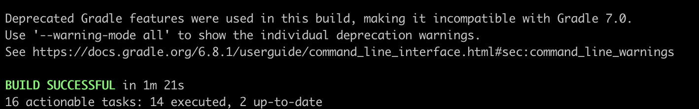
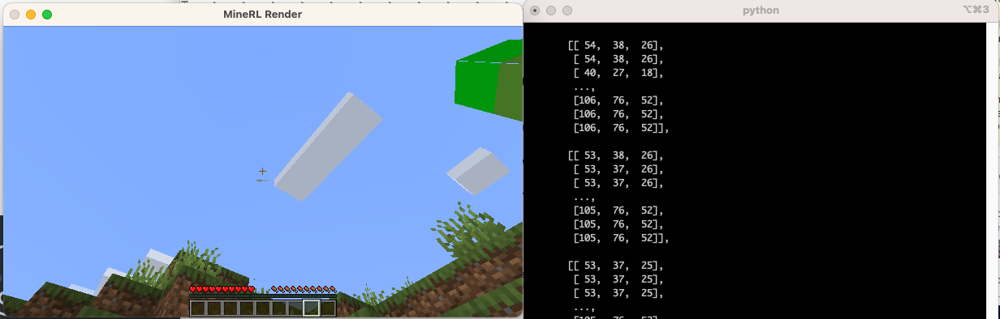

In this post, I lay out the steps to follow to resolve the errors you see when creating your [first MineRL agent](https://minerl.readthedocs.io/en/latest/tutorials/first_agent.html) on a macOS. This is a continuation of [this post](https://jmodeler.github.io/post/resolving-install-errors-with-minerl/), which looks at resolving install errors on the `minerl` package. 

I borrow heavily from [this github issue comment](https://github.com/minerllabs/minerl/issues/659#issuecomment-1306635414). 

1. Clone the repository using the terminal command below
   ```zsh
      git clone https://github.com/minerllabs/minerl.git
   ```
   This will create a `minerl` directory. Make sure that the path to the cloned repository does not have spaces in it (i.e. the path should **not** be `/Users/<username>/minerl folder/minerl` -- you will get `file not found` errors in the next few steps otherwise)

2. Open the patch file in the directory `minerl/scripts/mcp_patch.diff`, and replace version number `3.2.1` to `3.3.1` for `lwjgl-opengl` ([github link](https://github.com/minerllabs/minerl/blob/03510486957633676d269bf83115a84499ef7f47/scripts/mcp_patch.diff#L314) to part of the file where the version number should be replaced)

3. From inside the `minerl` folder on terminal, run the following command:
   ```zsh
      pip3 install .
   ```

4. If the installation fails, please go to this [post](https://jmodeler.github.io/post/resolving-install-errors-with-minerl/) and see if the steps outlined there can help.

5. If the installation is successful, navigate to the `minerl/minerl/MCP-Reborn` folder and open the `launchClient.sh` file in a text editor of choice. Modify a line close to the end of the file that starts with `Java ....`, so that the new line becomes:
   ```zsh
      java -Xmx$maxMem -XstartOnFirstThread -jar $fatjar --envPort=$port
   ```
  
6. Navigate to `MCP-Reborn/src/main/java/net/minecraft/client/MainWindow.java`, and make the following changes:

   - Comment out the following line (add a `//` to the left of this line)
   
     ```zsh
        GLFW.glfwSetWindowIcon(this.handle, buffer);
     ```
   - Comment out the body of the `checkGlfwError` method, it should look like this after commenting out the body:
   
     ```zsh
      public static void checkGlfwError(BiConsumer<Integer, String> glfwErrorConsumer) {
      /* RenderSystem.assertThread(RenderSystem::isInInitPhase);
            try (MemoryStack memorystack = MemoryStack.stackPush()) {
         PointerBuffer pointerbuffer = memorystack.mallocPointer(1);
         int i = GLFW.glfwGetError(pointerbuffer);
         if (i != 0) {
            long j = pointerbuffer.get();
            String s = j == 0L ? "" : MemoryUtil.memUTF8(j);
            glfwErrorConsumer.accept(i, s);
         }
      } */
      
      }
    ```
     **DO NOT** comment out/delete the method declaration, else the next step will fail. 

7. Navigate to the `minerl/minerl/MCP-Reborn` folder in terminal and rebuild `MCP-Reborn` using the command below:
   ```
      ./gradlew clean build shadowJar
   ```
   You should see a success message like the one below: 
   
8. Find the location where the `minerl` package was installed. If you use `pyenv` like I do, you can use the `pyenv which python` command in terminal, to get the version of python being used by the system. For example, if the version number is `3.11.2`, then the location of the `minerl` package should be:
   ```
       /Users/<username>/.pyenv/versions/3.11.2/lib/python3.11/site-packages/minerl
   ```

9. Navigate to the `minerl` folder above, and replace the `MCP-Reborn` folder in it with the `MCP-Reborn` folder you just built in step 7 above.

10. Follow the steps to [build your first agent](https://minerl.readthedocs.io/en/latest/tutorials/first_agent.html), this should work now and you should see something like this:
    
