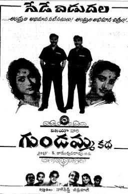
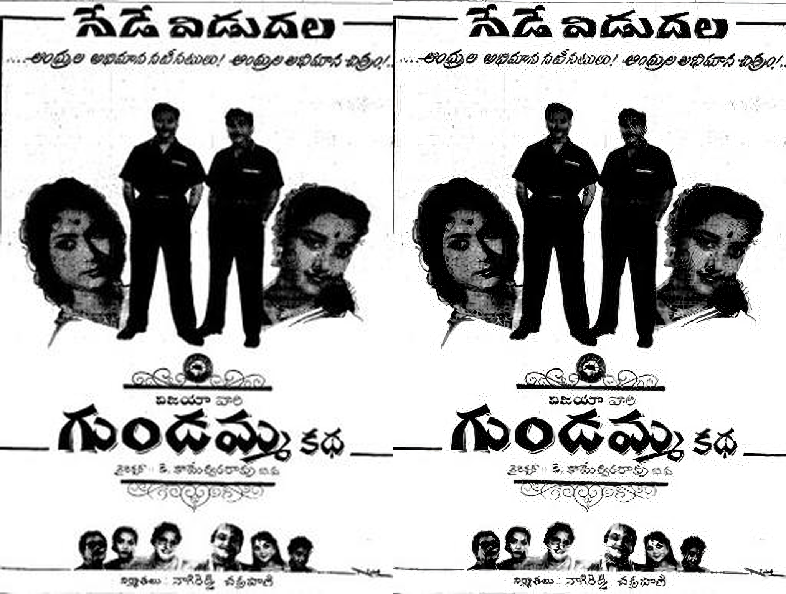

**TL;DR:** I attempt to upscale a low resolution movie poster using the [super_image](https://pypi.org/project/super-image/#pre-trained-models) python package. Though overall the image looks sharper, the text in the upscaled poster is not too clear.

  1. I have a poster of a movie released in 1962, it is not super high resolution:
  
  2. I wanted to see if I could upscale this poster using [super_image](https://pypi.org/project/super-image/#pre-trained-models), a freely available python package that contains various image upscaling models. 
  3. I first install the package using `pip install super_image`, the python version I'm using is 3.8.16, as setup in a [previous post](https://jmodeler.github.io/post/resolving-install-errors-for-the-lightweight-mmm-python-package/). I also installed the [pillow package](https://pypi.org/project/pillow/) for image processing help and [ipywidgets](https://pypi.org/project/ipywidgets/) for interactive widgets in Jupyter notebooks.
  4. I now attempt to upscale the image by 4x using the [DRLN](https://huggingface.co/eugenesiow/drln) (Densely Residual Laplacian Super-Resolution) method, since it is [ranked #1](https://pypi.org/project/super-image/#pre-trained-models) of the 16 models available for upscaling an image by 4x.
  5. Below is the code I used to do this. Note that the original image is in the same folder as the notebook that contained this code.
  
      ```
      # import packages needed
      from super_image import DrlnModel, ImageLoader
      from PIL import Image
      
      # create the image object
      image = Image.open('Gundamma_Katha.jpeg')
      
      # model, input and prediction steps
      model = DrlnModel.from_pretrained('eugenesiow/drln', scale=4)
      inputs = ImageLoader.load_image(image)
      preds = model(inputs)
      
      # check upscaled output
      ImageLoader.save_image(preds, './gk_4x_01.png')
      ImageLoader.save_compare(inputs, preds, './gk_4x_compare_01.png')
      ```
  
  6. The final image and the original image are provided below side by side for comparison:
  
    
  7. Though the final image is now larger and the image is sharper (for the most part), the text is not as clear in places (though decipherable and slightly better when compared to the original).
  
The code above can be modified to use the [other models](https://pypi.org/project/super-image/#pre-trained-models) listed on the package page. 

